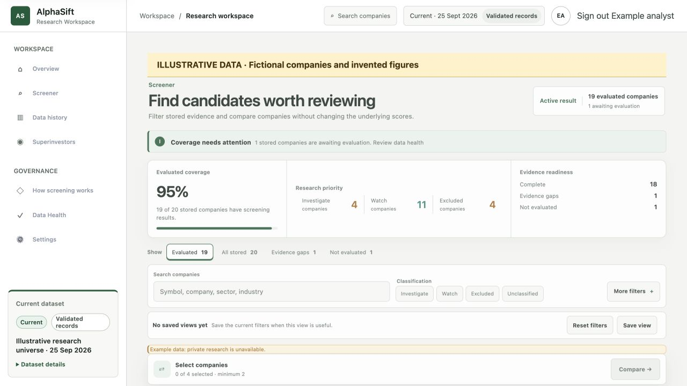
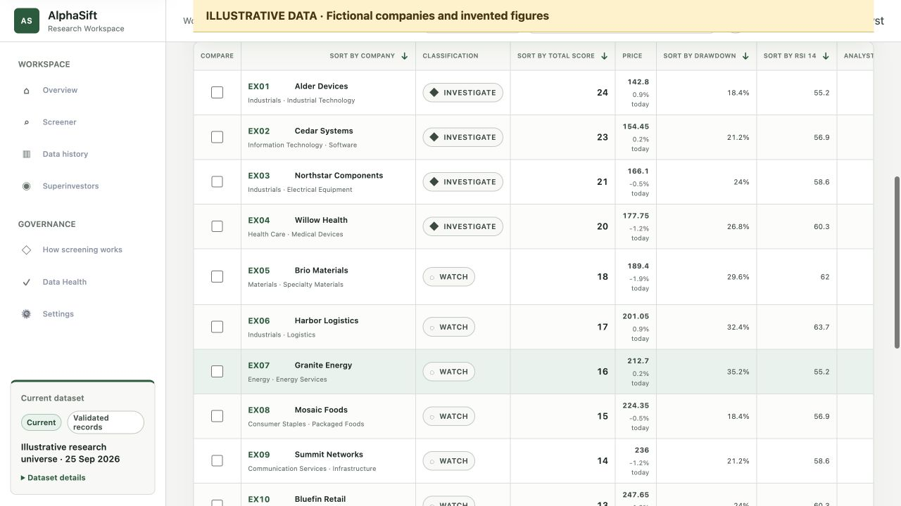
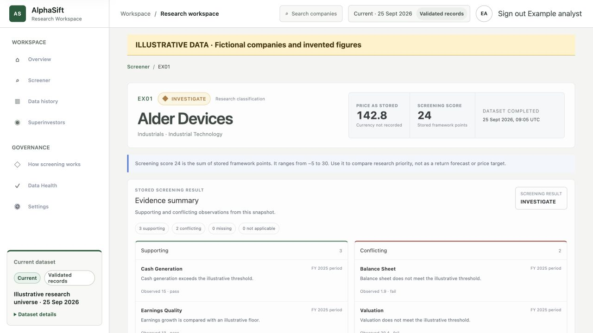
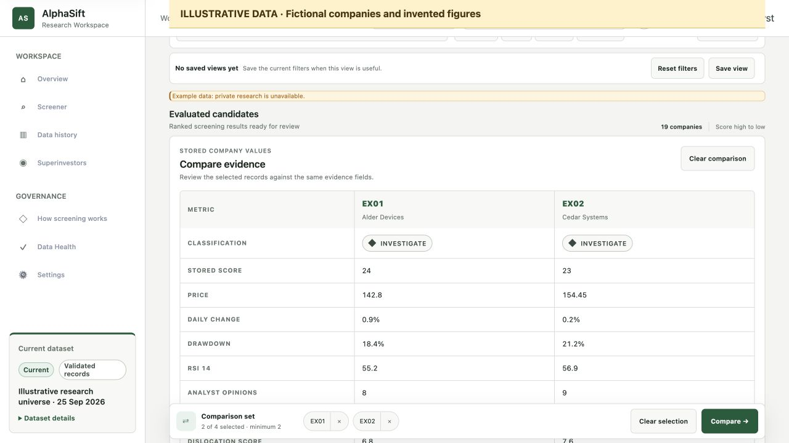
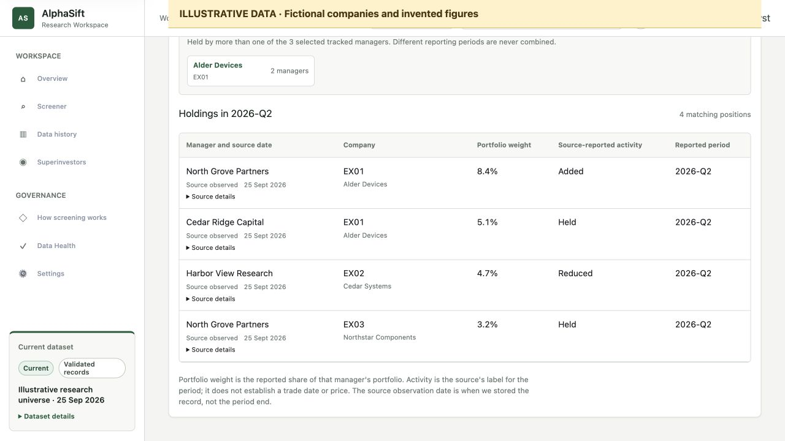
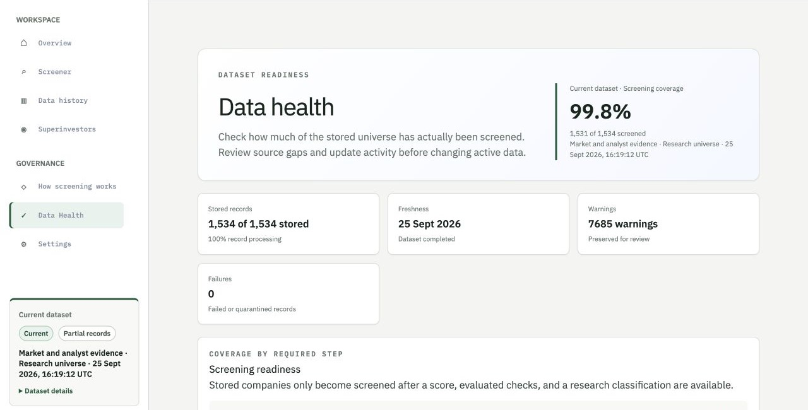
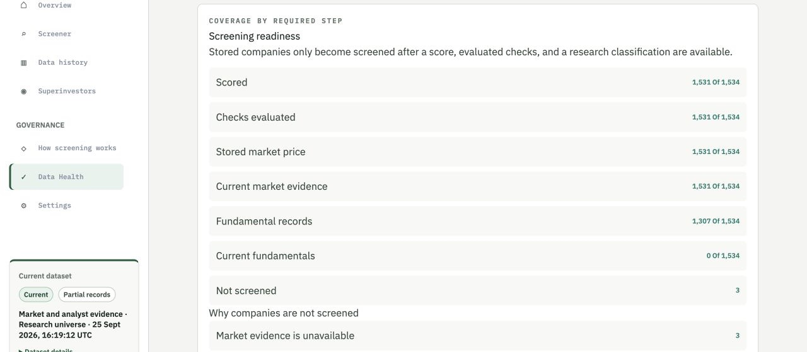
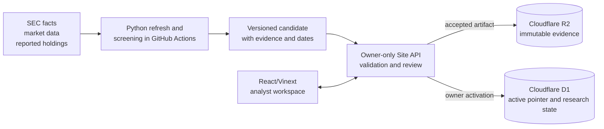

# AlphaSift

**An evidence-backed research queue for public-company screening.** AlphaSift helps an analyst move from a broad universe to companies worth investigating, then see why each company received its label. It is a working, owner-only beta. This repository is a separate case study, not the operational source or a public product login.

## Why build it?

A conventional screener can produce a ranked list faster than an analyst can test the list's evidence. A high score can look decisive even when the underlying filing is old, a quality check conflicts, or a ticker was never evaluated. The resulting work is scattered across price screens, filings, spreadsheets, and notes.

AlphaSift puts **priority, explanation, and data health in one workflow**. The intended benefit is a more disciplined first pass: an analyst can identify a candidate, inspect the supporting and conflicting observations, compare it with peers, and record what still needs verification. The product does not decide whether to buy or sell.

## What an analyst does

| Step | Question | In the product |
| --- | --- | --- |
| **Screen** | Which companies merit a closer look? | Search and filter the evaluated universe by research priority and evidence. Stored-but-unevaluated companies are kept separate. |
| **Inspect** | Why did this result appear? | Open a company to see its three score components, individual checks, market and financial observations, dates, and missing inputs. |
| **Compare** | What differs across candidates? | Compare up to four companies using the same stored fields and visible warnings. |
| **Track** | What should I verify next? | Save private research status, notes, watchlists, and screener views without changing imported evidence. |
| **Review data health** | Can I trust this dataset for this question? | Check screened coverage, source freshness, exceptions, and the history of candidate updates before relying on a result. |

For example, an *Investigate* label may coexist with two conflicting financial checks. That is a prompt to open the company, understand the conflict, and decide what to research. It is not a clean bill of health. Likewise, a company's absence from the evaluated list can mean missing market history rather than a negative assessment.

## Working product screens

These captures show the real AlphaSift interface. The screener, company, comparison, and Superinvestors screens use an [entirely fictional 20-company example](data/fictional-product-snapshot.json). Their yellow banners mark the invented companies, managers, holdings, prices, scores, and checks. The Data Health and screening-guide captures come from the owner-only beta and show aggregate results and product explanations, dated **26 September 2026**.

**1. Find a candidate.** In this fictional example, 19 of 20 companies have screening results; one is visibly unevaluated. The screener separates research priority from evidence readiness and lets an analyst filter the evaluated list.





**2. Open the evidence.** Fictional Alder Devices has an *Investigate* label and a score of 24, yet two of its five invented checks conflict. The page shows that conflict beside the label.



**3. Compare candidates.** Selecting two fictional companies opens a side-by-side comparison of their stored fields.



**4. Put reported ownership in context.** This Superinvestors capture uses invented managers, positions, weights, and activity labels. The product groups holdings by reporting period; a reported position does not prove a current trade.



**5. Check the dataset.** These authentic beta captures show 1,531 of 1,534 companies screened (99.8%) and distinguish refreshed market evidence from older financial records. Data Health also reports zero failed or quarantined records.





The [screening-guide capture](assets/product-screening-guide.jpg) shows how the product explains a result. A separate [two-company fictional walkthrough](demo/index.html) lets readers explore the coverage rule without credentials; it is a teaching aid, not a product screen.

## How the screening logic works

The pipeline gathers available financial history, price and analyst observations, and manager-holdings context. Every observation keeps its source and date. The active screening method assigns a **research-priority score from −5 to 30** using three established lenses:

| Lens | What it contributes | What the analyst should still check |
| --- | --- | --- |
| **Buffett-style quality** | Profitability, debt, competitive-position, and earnings points | Whether the financial history is current and the inputs are complete |
| **Lynch-style growth and price** | Growth assessed alongside valuation | Whether a favorable ratio is backed by durable growth |
| **Minervini-style momentum** | Price movement, growth, earnings news, and trend | Whether the price signal has changed since observation |

The stored point totals form *Investigate* (20–30), *Watch* (8–19), or *Excluded* (below 8). **Checks are a separate layer.** They show supporting, conflicting, or unavailable evidence; they do not silently add points to the score. A company counts as *screened* only when it has a score, evaluated checks, and a classification. A missing input is not a pass.

This is a preserved historical method, including some defaults that deserve scrutiny: missing debt/equity can earn low-debt points, and unknown earnings can count as a beat. AlphaSift surfaces those limits rather than presenting the number as a forecast. The [screening-method walkthrough](docs/screening-method.md) explains how to read the score, checks, and coverage together; the product links its guide to calculation details and underlying observations.

## How the system protects the research record



The Python engine separates provider retrieval from calculations and methodology rules. An owner-requested refresh runs in GitHub Actions and returns a versioned candidate artifact: scores, checks, classifications, missing states, method identity, and evidence dates travel together. The Site server validates that artifact and presents its impact for review before the owner activates it. D1 holds the active-dataset pointer, query state, and private research; R2 holds immutable evidence and exports. The React/Vinext interface uses the Site API rather than connecting to those stores directly. It reads accepted results without silently recalculating old scores. Owner notes and watchlists stay apart from imported evidence.

This separation matters when a provider returns incomplete data. The last accepted dataset stays available, and gaps remain visible. It also makes the history auditable: a past result can be read as it was stored under its original method rather than reinterpreted by a later algorithm.

## Data coverage and limits

The dataset shown here was generated on **25 September** and activated on **26 September 2026**. It screens **1,531 of 1,534 companies**. The other three lack price history from the current market source, so they remain *Not evaluated* rather than *Excluded*. Data Health shows coverage, source dates, warnings, and failed records for anyone reviewing a result.

Market evidence was refreshed within that dataset's observation window, while financial records remain older; none of the fundamental records are marked current. Refreshing prices does not refresh filings or manager holdings. AlphaSift has no live quote feed, return prediction, trade recommendation, or verified current superinvestor trades. This case study makes no measured claim about analyst time saved or investment performance. The operational Site and source repository remain private.

## Reproduce the coverage rule without access

The included [sample snapshot](data/synthetic-snapshot.json) contains two **fictional** companies with invented figures. One is stored and screened; the other is stored but lacks a score and remains unscreened. It demonstrates why “in the universe” is not the same as “evaluated” without requesting market data or exposing a private account.

```bash
python3 scripts/verify_example.py
# Verified fictional example: 2 stored, 1 screened, 1 not screened.
```

To explore the two-company teaching aid, run `python3 -m http.server 8000` at the repository root and open `http://localhost:8000/demo/`. It is separate from the working product interface shown above. The [20-company capture fixture](data/fictional-product-snapshot.json) documents the invented figures used in the example-data screenshots.

## Licensing and scope

The [MIT license](LICENSE.md) applies only to the illustrative walkthrough, fictional datasets, and example validator. The case-study text, screenshots, and AlphaSift name and visual identity are copyright © 2026 Puneet Chugh, with no reuse license granted. The working product's source code, private research, and market-data integrations are not included in this repository.

The screenshots document the beta as it stood on **26 September 2026**. The aggregate figures are dated product observations, not a live feed; the company-level examples are fictional as labelled above.
